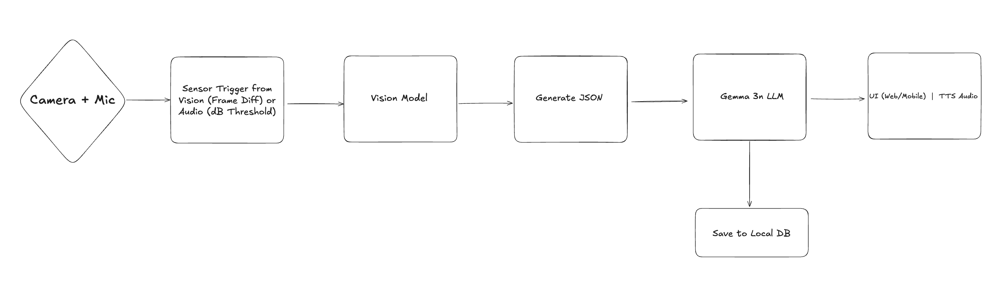

# Custorix - Private AI Security. No Cloud. No Compromise

## Project Overview

Custorix is a fully offline, privacy-first, AI-powered security assistant. It combines vision, audio, and natural language reasoning (LLM) to detect, interpret, and explain security events.

It runs on-device with no cloud dependencies offering real-time detection of people, vehicles, animals, and audio anomalies (like loud sounds). It then processes these detections with Gemma 3n, an on-device LLM, to produce natural-language alerts, logs, summaries, and risk assessments.

## Problem Solved
- Cloud based security cameras are privacy invasive
- Cameras fail if Wi-Fi/Internet is down
- Motion alerts have no context
- High false positives
- High fees

Custorix is fully offline, no cloud needed, and utilizes visions models and Gemma 3n to provide quality context and prevent false positives.

## Scope
- Person, Vehicle, Animals
- Audio Triggered Detection (via dB)
- LLM powered alerts, logs, summaries
- Fully offline edge deployment
- DIY camera hardware

## Pipeline

## Tools + Hardware
**DIY Security Camera Hardware:**
- Compute: Raspberry Pi 5
- Camera: Pi Camera v2, HQ Cam, or USB webcam
- Microphone: USB mic
- Storage: SD (Pi)
- Power Supply: 5V USB-C
- Case: Heatsink + Fan

**Software:**
- OS: Raspberry Pi OS
- Camera API: OpenCV
- Audio API: sounddevice, pyaudio
- Vision Model Runtime: Ollama/Unsloth?, ONNX Runtime, TensorRT, TFLite
- Vision Model: YOLOv11n (TFLite/ONNX) or MobileNet SSDLite
- Audio Trigger: dB threshold via mic input
- LLM: Gemma 3n via Ollama (desktop) or MLC.ai (embedded)
- UI: Flask/Streamlit (Web) or Flutter (Mobile)
- Data Storage: SQLite, optional CSV/PDF export

## Sources
- Vision Model: YOLOv11n pretrained on COCO
- Audio Trigger: No model needed — dB threshold
- Gemma LLM: Ollama pull Gemma-2B or 4B → fine-tuning optional

## Step by Step Build Plan
1. Hardware Setup + Rasberry Pi 5
2. Aduio Pipeline + Gemma
3. UI + Logging
4. Demo Polish
